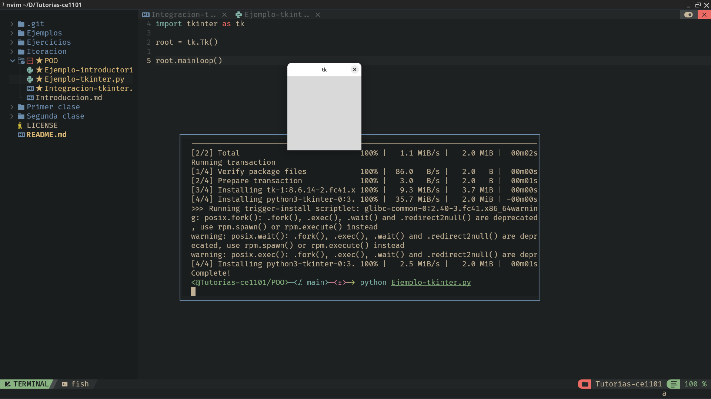
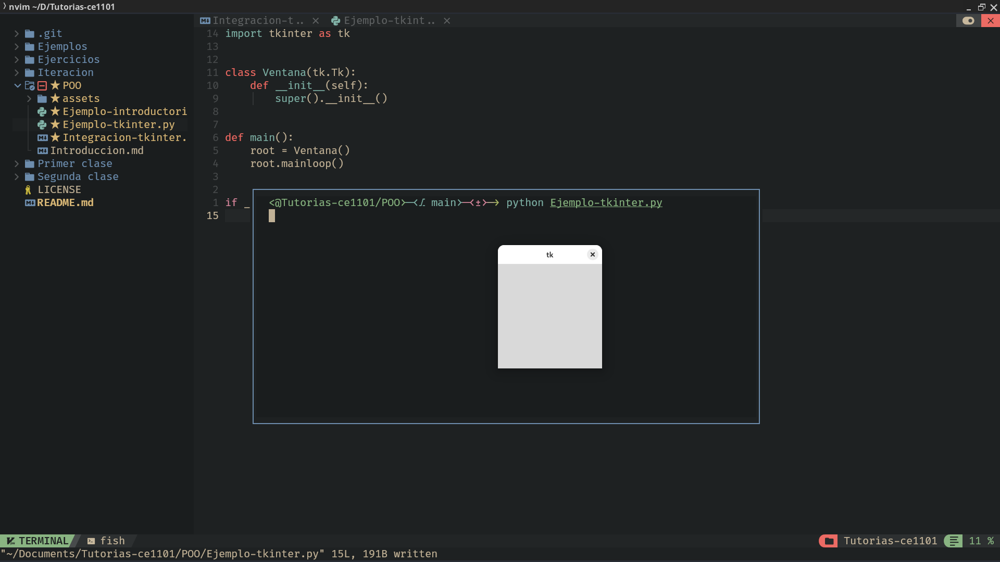
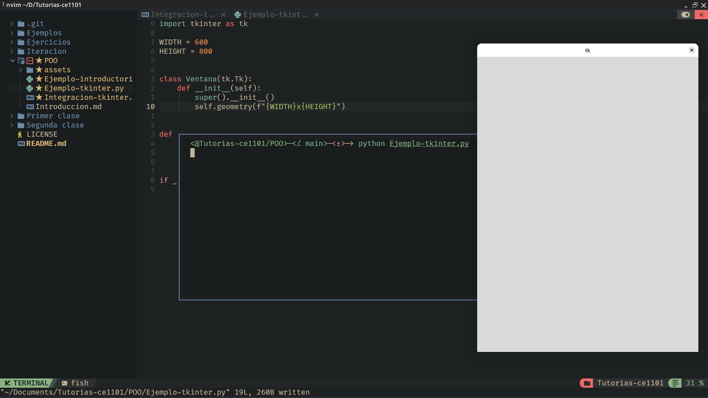
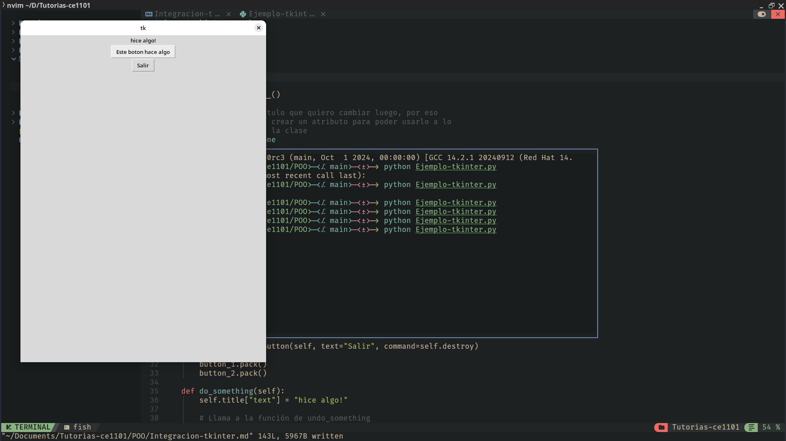

# Integrando Tkinter con la programación orientada a objetos
Si recuerdan, cuando nosotros creábamos una clase con tkinter, primero instanciamos un objeto 
llamado Tk, osea, la raíz.

```py
# Buena práctica importarlo como tk en vez de hacer "from tkinter import *"
import tkinter as tk

# Concepto de POO: ¡"root" es una instancia de Tk!
root = tk.Tk() 

# Loop principal
root.mainloop()
```



Si queremos tener una mayor cantidad de personalización sobre nuestra clase Tk, podemos crear una clase que herede a 
Tk y empezar a jugar nosotros con la misma.


```py
import tkinter as tk


class Ventana(tk.Tk):
    def __init__(self):
        super().__init__()


def main():
    root = Ventana()
    root.mainloop()


if __name__ == "__main__":
    main()
```
> Nota: ¿Alguna vez has visto esa nomenclatura? Me refiero al hecho de crear una clase main y ese if \_\_name\_\_ == "\_\_main\_\_". Esta es una buena práctica de programación cuando queremos hacer un código con muchos módulos. Cuando nosotros hacemos un import en python, este corre todo el código que tenga el módulo. Esto significa inicializar variables, funciones, hasta hacer un print en el módulo. ¿Alguna vez te ha dado error en la línea 5000 en tu código de 200 lineas? Es por eso. Este condicional if hace que ese código, dentro de la función main, corra sólo cuando llamamos a ese archivo directamente, no cuando lo importe. En palabras simples, si yo quiero importar Ventana desde otro archivo de python, no se me va a crear una instancia de la misma directamente. Es una buena práctica y se ve bonito, aprovéchalo.



## ¿Para qué sirve esto?
Esto nos sirve organizar el código de tal manera que sea legible, modulable y reutilizable. Nos permite crear una 
base sólida sobre nuestro programa, y es una buena práctica, especialmente con programas grandes. 

# Más buenas prácticas
## Definir constantes
Cuando nosotros trabajamos con interfaces gráficas, nos conviene definir constantes. En Python, no hay tal concepto 
como una constante, pero si podemos seguir una convención. Cuando creamos una variable, que queramos que sea constante,
la escribimos en mayúscula completamente. 
```py 
# Ejemplo con constantes 
# Primer teorema de ingeniería 
EULER = PI = 3  
GRAVEDAD = 10 
```
> Nota 1: En Python, podemos hacer que dos variables tomen el mismo valor al declararlas, haciendo uso de doble igual, como en este ejemplo.  
> Nota 2: Yo se que esos valores son incorrectos, solo quería hacer el chiste  
> Nota 3: Escribir las variables en mayúscula, la vuelve a prueba de tontos. A lo que me refiero es que si luego intentas cambiar el valor de esa constante en el programa, tu IDE o LS te puede tirar una warning, lo que evita que cambies una constante por accidente.
### ¿Cómo aplicamos esto en tkinter?
Nosotros definimos un tamaño fijo para nuestras ventanas, puede ser 1920x1080, 600x900, lo que queramos. En vez de estar 
reescribiendo estos valores todo el rato, podemos definir constantes, fuera de la clase, al inicio del programa. Capaz ocupamos accederlas desde fuera. 

```py
import tkinter as tk

WIDTH = 600
HEIGHT = 800


class Ventana(tk.Tk):
    def __init__(self):
        super().__init__()
        self.geometry(f"{WIDTH}x{HEIGHT}")


def main():
    root = Ventana()
    root.mainloop()


if __name__ == "__main__":
    main()
```



## Crear varias funciones 
Las funciones en Python son lentas, pero estamos usando Python, de por sí, va a ser lento. En este lenguaje, la magia está 
en hacer código que sea prácticamente como leer inglés. Si queremos ir agregando botones o canvas a nuestra ventana, es 
mejor separar todo en varias funciones para evitar un desastre en el código.  
Para ejemplificar esto, voy a crear varias funciones. 

```py
class Ventana(tk.Tk):
    def __init__(self):
        super().__init__()

        # Este es un título que quiero cambiar luego, por eso
        # es importante crear un atributo para poder usarlo a lo
        # largo de toda la clase
        self.title = None

        # El orden importa, así que asegúrense que tiene un orden correcto
        self.create_attributes()
        self.create_title()
        self.create_buttons()

    def create_attributes(self):
        self.geometry(f"{WIDTH}x{HEIGHT}")
        self.resizable(False, False)

    def create_title(self):
        # Modificamos el título y le ponemos la label que es
        self.title = tk.Label(
            self, text="Este es un titulo para nuestro hermoso programa"
        )
        self.title.pack()

    def create_buttons(self):
        button_1 = tk.Button(
            self, text="Este boton hace algo", command=self.do_something
        )

        button_2 = tk.Button(self, text="Salir", command=self.destroy)

        button_1.pack()
        button_2.pack()

    def do_something(self):
        self.title["text"] = "hice algo!"

        # Llama a la función de undo_something
        # luego de 1.5 segundos (1500 milisegundos)
        self.after(1500, self.undo_something)

    def undo_something(self):
        self.title["text"] = "Este es un título para nuestro hermoso programa"
```
> Nota: En la función de do_something, apareció una nueva función misteriosa... after. Esta función nos permite ejecutar otra función luego de la cantidad de milisegundos que especifiquemos. Esta función es especialmente buena porque, de otro modo, tendríamos que utilizar hilos para llamar una función luego de cierto tiempo. En cambio, tkinter hace ese procedimiento por nosotros en esa función, ya que el mismo funciona con hilos. De hecho, la misma función mainloop es un hilo. 



¿Notan cómo el código es más limpio así? Esta es la ventaja de POO y aplicarlo con tkinter. Ahora, podemos crear programas con mucha capacidad de personalización gracias a esto. 
